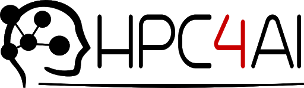

<!-- PROJECT SHIELDS -->
<!--
*** I'm using markdown "reference style" links for readability.
*** Reference links are enclosed in brackets [ ] instead of parentheses ( ).
*** See the bottom of this document for the declaration of the reference variables
*** for contributors-url, forks-url, etc. This is an optional, concise syntax you may use.
*** https://www.markdownguide.org/basic-syntax/#reference-style-links
-->
[![Contributors][contributors-shield]][contributors-url]
[![Forks][forks-shield]][forks-url]
[![Stargazers][stars-shield]][stars-url]
[![Issues][issues-shield]][issues-url]
[![MIT License][license-shield]][license-url]
[![LinkedIn][linkedin-shield]][linkedin-url]


<!-- PROJECT LOGO -->
<br />
<p align="center">
  <a href="https://github.com/MachineLearningJournalClub/P300_Speller_VBH_2021">
    
    
  </a>

  <h3 align="center">ECoG Hand Pose Data Analysis - Virtual Brain Hackathon 2021</h3>

<!-- TABLE OF CONTENTS -->
<details open="open">
  <summary><h2 style="display: inline-block">Table of Contents</h2></summary>
  <ol>
    <li>
      <a href="#about-the-project">About The Project</a>
    </li>
    <li>
      <a href="#getting-started">Getting Started</a>
      <ul>
        <li><a href="#installation">Installation</a></li>
      </ul>
    </li>
    <li><a href="#contributing">Contributing</a></li>
    <li><a href="#license">License</a></li>
    <li><a href="#contact">Contact</a></li>
    <li><a href="#acknowledgements">Acknowledgements</a></li>
  </ol>
</details>


<!-- ABOUT THE PROJECT -->
## About The Project
The P300 speller BCI system consisted of electroencephalography acquisition connected to real-time processing software and separate keyboard-display control software. It was first described by Sutton et al.( 1965 ) and has been widely studied since then to explore higher cortical functions in humans (for review see Bashore & Van der Molen, 1991; Donchin, 1981; Duncan et al., 2009; Fabiani et al., 1987; Polich, 2007; Pritchard, 1981 ). Although it often occurs at a latency of about 300 ms relative to the eliciting stimulus (hence the designation of P300), its latency may vary from 250 to 750 ms (Comerchero & Polich, 1999 ; Maglieroet al., 1984; McCarthy & Donchin, 1981; Polich, 2007 ). This variability in latency reflects the fact that the P300 is elicited by the decision, not necessarily conscious, that a rare event has occurred, and the decision latency can and does, vary with the nature (e.g., the difficulty) of the decision (Kutas et al., 1977 ).
The P300 is usually largest over the central parietal scalp and attenuates gradually as the distance from this area increases.

<p align="center">
  <cite>
    @credit: Xiaogang Chen et al./PNAS
  </cite>
  
</p>

A visual paradigm based P300 speller system consists of several stages:

- Stimulating a subject by presenting a P300 processing;
- Feature extraction; 
- Classification.

During the Hackathon we faced a problem with two different paradigms used to implement the P300 speller: (i) the row/column (RC) speller highlights multiple characters at once and (ii) the single character (SC) speller flashes each character individually (see "How many people are able to control a P300-based brain-computer interface (BCI)?" by Christoph Guger et al. for more details).

We started with 5 matrix of raw data from 5 different patients. Each matrix had a dimension of: 60000 rows and 8 columns (one column for each channel). 


<!-- GETTING STARTED -->
## Getting Started

To get a local copy up and running follow these simple steps.


### Installation

1. Clone the repo
   ```sh
   git clone https://github.com/MachineLearningJournalClub/P300_Speller_VBH_2021
   ```


<!-- CONTRIBUTING -->
## Contributing

Contributions are what make the open source community such an amazing place to be learn, inspire, and create. Any contributions you make are **greatly appreciated**.

1. Fork the Project
2. Create your Feature Branch (`git checkout -b feature/AmazingFeature`)
3. Commit your Changes (`git commit -m 'Add some AmazingFeature'`)
4. Push to the Branch (`git push origin feature/AmazingFeature`)
5. Open a Pull Request


<!-- LICENSE -->
## License

Distributed under the MIT License. See `LICENSE` for more information.


<!-- CONTACT -->
## Contact

Luca Bottero - email : [luca.bottero192@edu.unito.it](luca.bottero192@edu.unito.it) - [linkedin]()

Ilaria Gesmundo - [ila.gesmundo@gmail.com](ila.gesmundo@gmail.com) :  - [linkedin]()

Letizia Pizzini  - email : [letizia.pizzini@edu.unito.it](letizia.pizzini@edu.unito.it) - [linkedin]()

Aurora Micheli - email : [aurora.micheli@edu.unito.it](aurora.micheli@edu.unito.it) - [linkedin]()

Flavio Sartori - email : [flavio.sartori@edu.unito.it](flavio.sartori@edu.unito.it) - [linkedin](https://www.linkedin.com/in/flavio-sartori-474a871b2)

Project Link: [https://github.com/MachineLearningJournalClub/P300_Speller_VBH_2021](https://github.com/MachineLearningJournalClub/P300_Speller_VBH_2021)


<!-- ACKNOWLEDGEMENTS -->
## Acknowledgements

<p align="center">
  <a href="https://github.com/MachineLearningJournalClub/P300_Speller_VBH_2021">
    
    
    
    
  </a>

* [Br41n.io Spring School 2021](https://www.br41n.io/Spring-School-2021)
* [HPC4AI](https://hpc4ai.it/)


<!-- MARKDOWN LINKS & IMAGES -->
<!-- https://www.markdownguide.org/basic-syntax/#reference-style-links -->
[contributors-shield]: https://img.shields.io/github/contributors/MachineLearningJournalClub/P300_Speller_VBH_2021.svg?style=for-the-badge
[contributors-url]: https://github.com/MachineLearningJournalClub/P300_Speller_VBH_2021/graphs/contributors
[forks-shield]: https://img.shields.io/github/forks/MachineLearningJournalClub/P300_Speller_VBH_2021.svg?style=for-the-badge
[forks-url]: https://github.com/MachineLearningJournalClub/P300_Speller_VBH_2021/network/members
[stars-shield]: https://img.shields.io/github/stars/MachineLearningJournalClub/P300_Speller_VBH_2021.svg?style=for-the-badge
[stars-url]: https://github.com/MachineLearningJournalClub/P300_Speller_VBH_2021/stargazers
[issues-shield]: https://img.shields.io/github/issues/MachineLearningJournalClub/P300_Speller_VBH_2021.svg?style=for-the-badge
[issues-url]: https://github.com/MachineLearningJournalClub/P300_Speller_VBH_2021/issues
[license-shield]: https://img.shields.io/github/license/MachineLearningJournalClub/P300_Speller_VBH_2021.svg?style=for-the-badge
[license-url]: https://github.com/MachineLearningJournalClub/P300_Speller_VBH_2021/blob/main/LICENSE.md
[linkedin-shield]: https://img.shields.io/badge/-LinkedIn-black.svg?style=for-the-badge&logo=linkedin&colorB=555
[linkedin-url]: https://www.linkedin.com/company/machine-learning-journal-club
