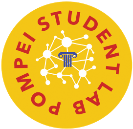

<!-- PROJECT SHIELDS -->
<!--
*** I'm using markdown "reference style" links for readability.
*** Reference links are enclosed in brackets [ ] instead of parentheses ( ).
*** See the bottom of this document for the declaration of the reference variables
*** for contributors-url, forks-url, etc. This is an optional, concise syntax you may use.
*** https://www.markdownguide.org/basic-syntax/#reference-style-links
-->
[![Contributors][contributors-shield]][contributors-url]
[![Forks][forks-shield]][forks-url]
[![Stargazers][stars-shield]][stars-url]
[![Issues][issues-shield]][issues-url]
[![MIT License][license-shield]][license-url]
[![LinkedIn][linkedin-shield]][linkedin-url]


<!-- PROJECT LOGO -->
<br />
<p align="center">
  <a href="https://github.com/MachineLearningJournalClub/P300_Speller_VBH_2021">
    
    
  </a>

  <h3 align="center">ECoG Hand Pose Data Analysis - Virtual Brain Hackathon 2021</h3>

  <p align="center">
    project_description
    <br />
    <a href="https://github.com/MachineLearningJournalClub/P300_Speller_VBH_2021"><strong>Explore the docs »</strong></a>
    <br />
    <br />
    <a href="https://github.com/MachineLearningJournalClub/P300_Speller_VBH_2021">View Demo</a>
    ·
    <a href="https://github.com/MachineLearningJournalClub/P300_Speller_VBH_2021">Report Bug</a>
    ·
    <a href="https://github.com/MachineLearningJournalClub/P300_Speller_VBH_2021">Request Feature</a>
  </p>
</p>


<!-- TABLE OF CONTENTS -->
<details open="open">
  <summary><h2 style="display: inline-block">Table of Contents</h2></summary>
  <ol>
    <li>
      <a href="#about-the-project">About The Project</a>
      <ul>
        <li><a href="#built-with">Built With</a></li>
      </ul>
    </li>
    <li>
      <a href="#getting-started">Getting Started</a>
      <ul>
        <li><a href="#prerequisites">Prerequisites</a></li>
        <li><a href="#installation">Installation</a></li>
      </ul>
    </li>
    <li><a href="#usage">Usage</a></li>
    <li><a href="#roadmap">Roadmap</a></li>
    <li><a href="#contributing">Contributing</a></li>
    <li><a href="#license">License</a></li>
    <li><a href="#contact">Contact</a></li>
    <li><a href="#acknowledgements">Acknowledgements</a></li>
  </ol>
</details>


<!-- ABOUT THE PROJECT -->
## About The Project

[![Product Name Screen Shot][product-screenshot]](https://example.com)

Here's a blank template to get started:
**To avoid retyping too much info. Do a search and replace with your text editor for the following:**
`github_username`, `repo_name`, `twitter_handle`, `email`, `project_title`, `project_description`


<!-- GETTING STARTED -->
## Getting Started

To get a local copy up and running follow these simple steps.


### Installation

1. Clone the repo
   ```sh
   !git clone https://github.com/MachineLearningJournalClub/P300_Speller_VBH_2021
   ```


<!-- USAGE EXAMPLES -->
## Usage

Use this space to show useful examples of how a project can be used. Additional screenshots, code examples and demos work well in this space. You may also link to more resources.

_For more examples, please refer to the [Documentation](https://example.com)_


<!-- ROADMAP -->
## Roadmap

See the [open issues](https://github.com/github_username/repo_name/issues) for a list of proposed features (and known issues).


<!-- CONTRIBUTING -->
## Contributing

Contributions are what make the open source community such an amazing place to be learn, inspire, and create. Any contributions you make are **greatly appreciated**.

1. Fork the Project
2. Create your Feature Branch (`git checkout -b feature/AmazingFeature`)
3. Commit your Changes (`git commit -m 'Add some AmazingFeature'`)
4. Push to the Branch (`git push origin feature/AmazingFeature`)
5. Open a Pull Request


<!-- LICENSE -->
## License

Distributed under the MIT License. See `LICENSE` for more information.


<!-- CONTACT -->
## Contact

Luca Bottero - email : [luca.bottero192@edu.unito.it](luca.bottero192@edu.unito.it) - [linkedin]()

Ilaria Gesmundo - [ila.gesmundo@gmail.com](ila.gesmundo@gmail.com) :  - [linkedin]()

Letizia Pizzini  - email : [letizia.pizzini@edu.unito.it](letizia.pizzini@edu.unito.it) - [linkedin]()

Aurora Micheli - email : [aurora.micheli@edu.unito.it](aurora.micheli@edu.unito.it) - [linkedin]()

Flavio Sartori - email : [flavio.sartori@edu.unito.it](flavio.sartori@edu.unito.it) - [linkedin]()

Project Link: [https://github.com/MachineLearningJournalClub/P300_Speller_VBH_2021](https://github.com/MachineLearningJournalClub/P300_Speller_VBH_2021)


<!-- ACKNOWLEDGEMENTS -->
## Acknowledgements

<p align="center">
  <a href="https://github.com/MachineLearningJournalClub/P300_Speller_VBH_2021">
    
    
    
    
  </a>

* [Br41n.io Spring School 2021](https://www.br41n.io/Spring-School-2021)
* [HPC4AI](https://hpc4ai.it/)


<!-- MARKDOWN LINKS & IMAGES -->
<!-- https://www.markdownguide.org/basic-syntax/#reference-style-links -->
[contributors-shield]: https://img.shields.io/github/contributors/MachineLearningJournalClub/P300_Speller_VBH_2021.svg?style=for-the-badge
[contributors-url]: https://github.com/MachineLearningJournalClub/P300_Speller_VBH_2021/graphs/contributors
[forks-shield]: https://img.shields.io/github/forks/MachineLearningJournalClub/P300_Speller_VBH_2021.svg?style=for-the-badge
[forks-url]: https://github.com/MachineLearningJournalClub/P300_Speller_VBH_2021/network/members
[stars-shield]: https://img.shields.io/github/stars/MachineLearningJournalClub/P300_Speller_VBH_2021.svg?style=for-the-badge
[stars-url]: https://github.com/MachineLearningJournalClub/P300_Speller_VBH_2021/stargazers
[issues-shield]: https://img.shields.io/github/issues/MachineLearningJournalClub/P300_Speller_VBH_2021.svg?style=for-the-badge
[issues-url]: https://github.com/MachineLearningJournalClub/P300_Speller_VBH_2021/issues
[license-shield]: https://img.shields.io/github/license/MachineLearningJournalClub/P300_Speller_VBH_2021.svg?style=for-the-badge
[license-url]: https://github.com/MachineLearningJournalClub/P300_Speller_VBH_2021/blob/main/LICENSE.md
[linkedin-shield]: https://img.shields.io/badge/-LinkedIn-black.svg?style=for-the-badge&logo=linkedin&colorB=555
[linkedin-url]: https://www.linkedin.com/company/machine-learning-journal-club
